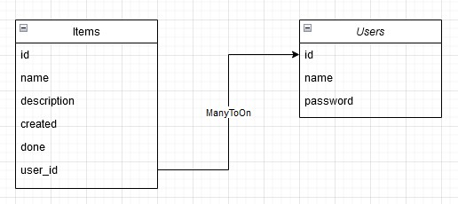
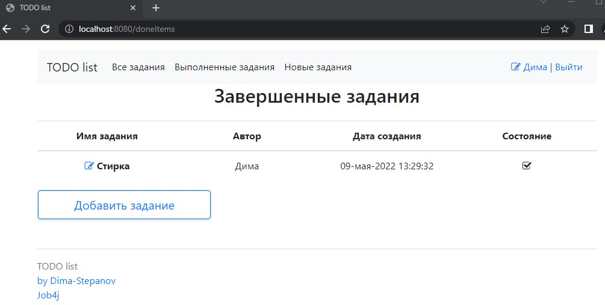

<h2>2. Создать TODO list [#3786]</h2>

1. Схема таблицы SQL  

  

2. MVC модель приложения и зависимости между формами и запросами.  

  

3. При входе на сервис Пользователь попадает на страницу авторизации.  
   При этом если пользователь не авторизован то возможны переходы на страницы  
   "login", "newUser". Со стоаницы "login" возможно зарегистрировать нового пользователя,  
   Перейдя по ссылке "Регистрация". При неудачной авторизации, регистрации меняется статус вида  

  

  

После авторизации при нажатии на значеке "листок/карандаш" открывается форма редактирования пользователя.  
при этом учитывается уникальность имен пользователей, при совпадении имен меняются статус события.  

 

4. Общий вид главной страницы. Отображается все задания авторизованного пользователя.  
   Первый столбец отображает имя задания, второй автора, третий дату создания,  
   четвертый состояние если галочка задача закрыта, если галочки нет задача открыта.  

  

5.Вкладка выполненные задания отображает завершенные задания авторизованного пользователя.  
У всех заданий столбец статус без галочки.  

  

6.Вкладка новые задания отображает не завершенные задания авторизованного пользователя.  
У всех заданий столбец статус с галочки.  

  

При нажатии на кнопку "Добавить задание", открывается вид для заполнения полей нового задания.  

  

После нажатия кнопки сохранить отображается детали нового задания.   
Так же отображается статус успешного отображения задания.  
При этом новое задание принадлежит авторизованному пользователю  

  

7. На главной странице, а так же на вкладках выполненных и новых заданий,  
   перед названием задачи расположена активная ссылка в виде "листа с карандашом".  
   При переходе по ссылке открывается форма с деталями задания(полным описанием).  
   При этом если задание не завершено то отображается три кнопки, Выполнено, Редактировать, Удалить.  

  

Если задание завершено отображается только две кнопки. Редактировать и Удалить  

  

8. При нажатии на кнопку редактировать открывается форма для редактирования задачи.  
   При этом в активных полях записаны текущие значения.  

  

После редактирования и нажатия кнопки сохранить, открывается форма деталей задачи,  
и отображением успешного статуса изменения.  
Если осуществлялась редактирование закрытой задачи, то задача становится активной.  
У всех отредактированных задач время создания меняется на время редактирования.  

  

9. При нажатии кнопки выполнить задаче присваивается время завершения.  
   И задача переходит в статус завершенной.  

10. При нажатии на кнопку удалить, задача удаляется и открывается главная страница,  
    при этом отражается статус успешного выполнения задачи.  

Реализация:  
Согласно ТЗ реализовано три слоя: Контроллеры, Сервисы, Персистенции.  
Стек технологий: Spring boot, Thymeleaf, Bootstrap, Hibernate, PostgreSql.  
На классы Store и Controller написаны тесты liquibase и mockito соответственно.  
Добавлен фильтр Servlet Filter для работы с сервисом только авторизованным пользоваттелям  